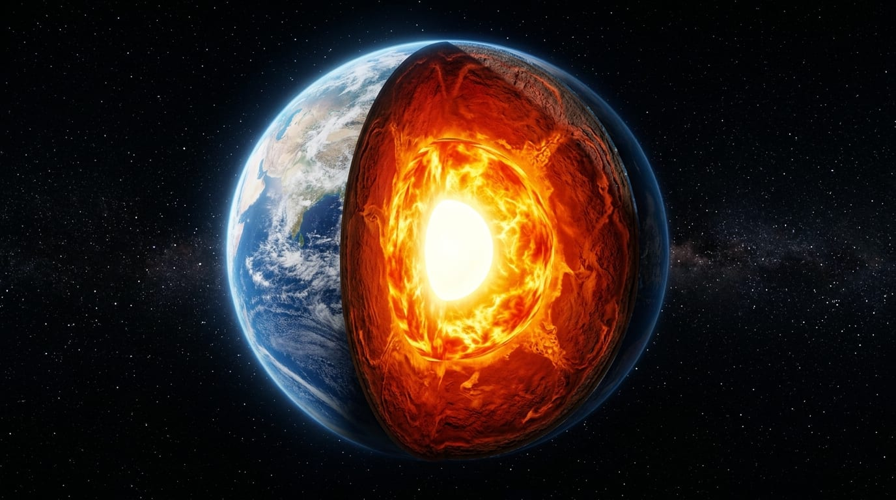
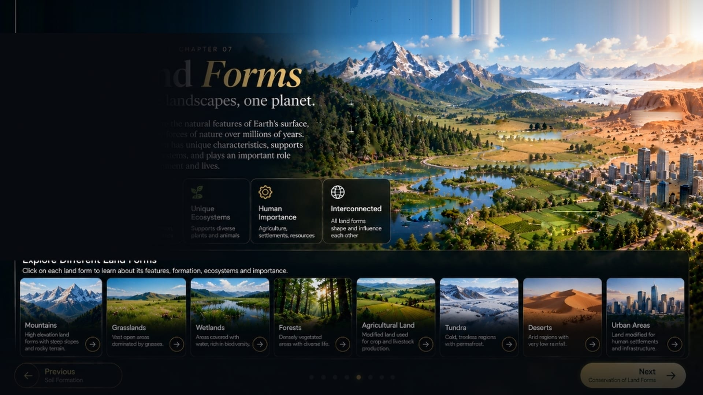
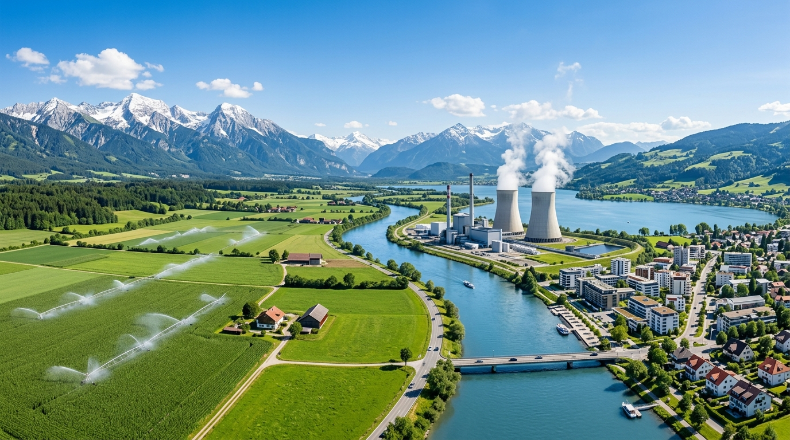
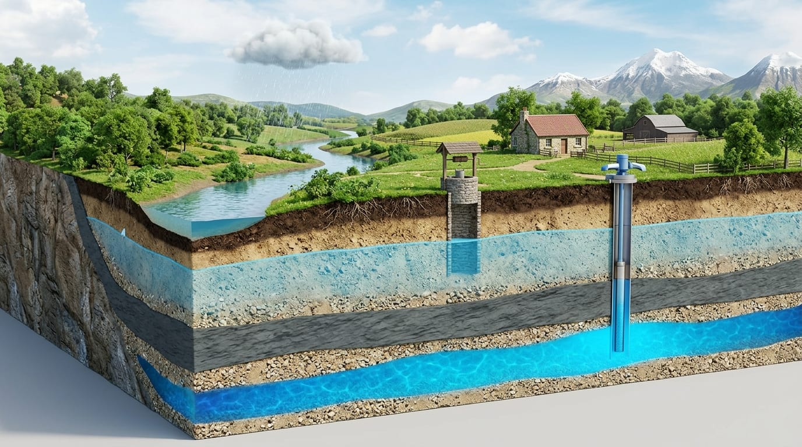
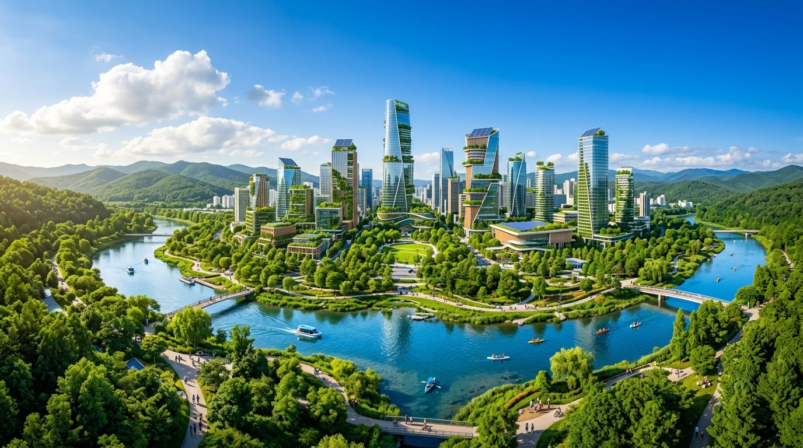
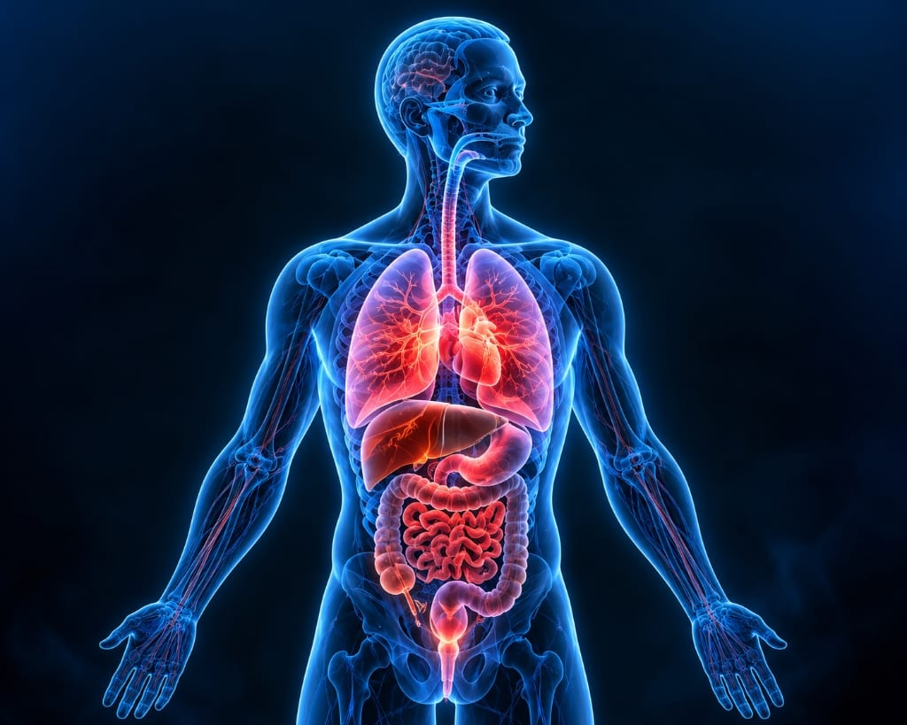
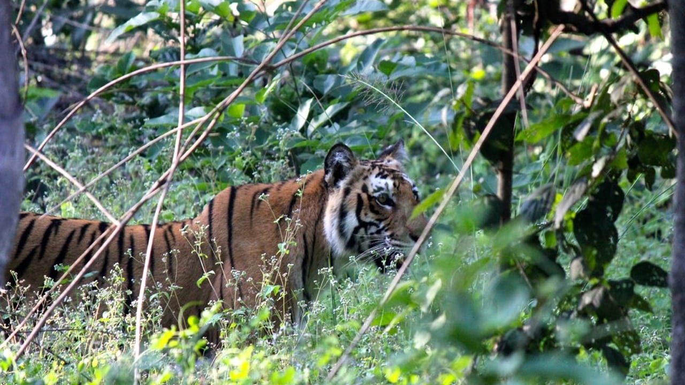
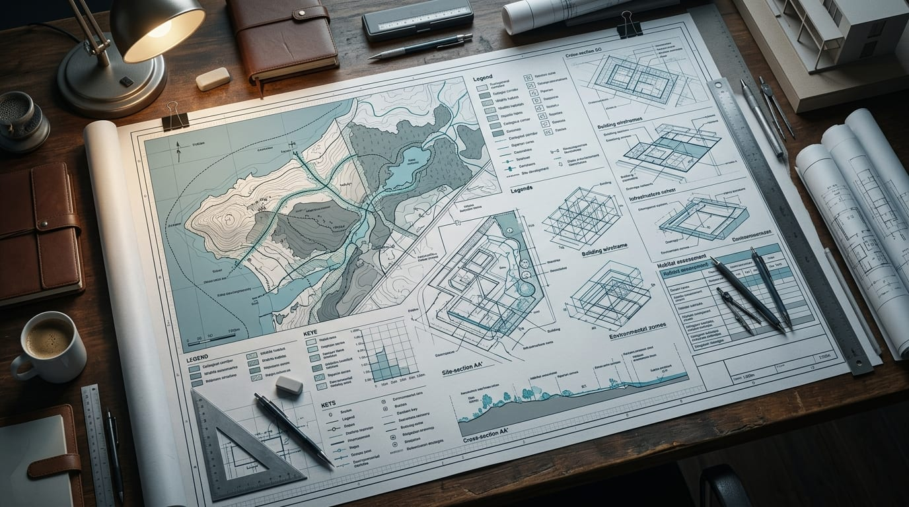
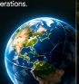
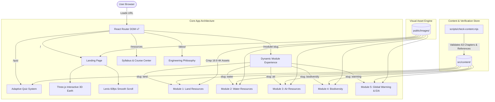

# TERRA — Conservation of Natural Resources (BCV755B)

<p align="center">
  
</p>

<p align="center">
  <strong>An immersive, cinematic, WebGL-powered interactive learning platform engineered for the VTU 7th Semester B.E. curriculum.</strong>
</p>

<p align="center">
  <a href="#-curriculum--module-deep-dives"></a>
  <a href="#-course-information--syllabus-mapping"></a>
  <a href="#-technology-stack"></a>
  <a href="#-verification-and-production-build"></a>
  <a href="#-license"></a>
</p>

---

## 📖 Table of Contents

- [Executive Summary & Vision](#-executive-summary--vision)
- [Platform Architecture & Interactive Features](#-platform-architecture--interactive-features)
- [Curriculum & Module Deep Dives](#-curriculum--module-deep-dives)
  - [Module 1: Land Resources & Lithosphere](#-module-1-land-resources--lithosphere)
  - [Module 2: Water Resources & Hydrosphere](#-module-2-water-resources--hydrosphere)
  - [Module 3: Air Resources & Atmosphere](#-module-3-air-resources--atmosphere)
  - [Module 4: Biodiversity & Ecological Capital](#-module-4-biodiversity--ecological-capital)
  - [Module 5: Global Warming & Environmental Impact Assessment (EIA)](#-module-5-global-warming--environmental-impact-assessment-eia)
- [Assessment & Examination Engine](#-assessment--examination-engine)
- [Technology Stack](#-technology-stack)
- [System Architecture](#-system-architecture)
- [Directory Structure](#-directory-structure)
- [Getting Started & Local Setup](#-getting-started--local-setup)
- [Verification & Production Build](#-verification--production-build)
- [Deployment Guidelines](#-deployment-guidelines)
- [Course Information & Syllabus Mapping](#-course-information--syllabus-mapping)
- [License & Attributions](#-license--attributions)

---

## 🌍 Executive Summary & Vision

**TERRA** is a state-of-the-art educational web application built specifically for the course **Conservation of Natural Resources (Subject Code: BCV755B)** under the Visvesvaraya Technological University (VTU) Bachelor of Engineering (B.E.) 7th Semester curriculum (Information Science & Engineering / Civil Engineering / Allied Disciplines).

Traditional natural resource pedagogy often relies on dense, static PDF notes that fail to convey the dynamic, planetary-scale systems governing our biosphere. **TERRA** transforms these concepts into an exploratory, cinematic digital experience. Through real-time 3D WebGL visualizations, interactive hydrogeological aquifer cutaways, toxicological air impact analyzers, river interlinking spatial explorers, and full Environmental Impact Assessment (EIA) workflows, students and engineers gain a holistic, rigorous comprehension of environmental stewardship.

<p align="center">
  
</p>

---

## ⚡ Platform Architecture & Interactive Features

### 1. Interactive 3D Earth Cutaway (Three.js & WebGL)
- **Planetary Accretion & Strata Exploration:** An interactive, hardware-accelerated 3D Earth rendered via `@react-three/fiber` and `@react-three/drei`.
- **Dynamic Interior Peeling:** Smoothly slice into the Earth to inspect the Crust (0–70 km), Solid Mantle (2,900 km), Molten Outer Core (2,200 km), and Solid Inner Core (1,220 km) with physical shading and volumetric atmospheric illumination.
- **Orbit Controls & Spatial Hotspots:** Users can rotate, zoom, and inspect tectonic boundaries and geological fault lines in real time.

### 2. Hydrogeological Aquifer Simulator
- **Interactive Aquifer Layers:** Side-by-side comparative simulation of unconfined aquifers, confining impermeable aquitards, and confined artesian aquifers.
- **Dynamic Water Table & Hydraulic Heads:** Real-time visual toggles showcasing water extraction via traditional dug wells versus deep mechanical tube wells.
- **Coastal Seawater Ingress Dynamics:** Interactive visualization illustrating the Ghyben-Herzberg relation where fresh water over-extraction triggers saline water encroachment into coastal drinking reservoirs.

### 3. Atmospheric AQI & Deep-Organ Toxicology Scanner
- **National Ambient Air Quality Standards (NAAQS):** Real-time interactive AQI slider spanning Good (0–50), Moderate (51–100), Unhealthy (101–200), Very Unhealthy (201–300), and Hazardous (301–500).
- **Deep Tissue Toxicology Viewer:** Biological cross-section mapping pollutant penetration:
  - **PM10:** Nasal passage and pharynx irritation.
  - **PM2.5 & Ultrafine particles:** Alveolar penetration, systemic capillary diffusion, and cardiovascular thrombosis.
  - **CO & NOx:** Carboxyhemoglobin formation and systemic hypoxia.

### 4. Inter-Basin Water Transfer (IBWT) Cartography
- **India River Linking Project (NRLP):** Interactive analysis of Peninsular and Himalayan links, including the Ken-Betwa link and Godavari-Krishna diversion canal.
- **Hydrological Balance:** Quantitative analysis of flood-surplus river basins versus water-deficit drought regions.

### 5. Adaptive Self-Assessment Engine
- **Module-Specific & Comprehensive Exams:** 50+ rigorously curated multiple-choice engineering questions categorized by module.
- **Real-Time Feedback:** Instant rationale breakdown, score telemetry, chapter references, and historical retake analytics.

---

## 📚 Curriculum & Module Deep Dives

### 🏔️ Module 1: Land Resources & Lithosphere

*Covers 13 comprehensive interactive chapters detailing planetary formation, internal geodynamics, global landforms, pedogenesis, and soil conservation.*

<p align="center">
  
  
</p>

#### Key Syllabus Topics & Chapters:
1. **Origin & Evolution of Earth:** Solar nebula hypothesis, planetary accretion, differentiation of planetary layers, and radioactive decay heating.
2. **Concentric Earth Layers:**
   - **Crust:** Continental (sial, 30–70 km) vs. Oceanic (sima, 5–10 km).
   - **Mantle:** Asthenosphere, convection currents driving plate tectonics (2,900 km).
   - **Outer Core:** Liquid iron-nickel generating Earth’s geomagnetic field (2,250 km).
   - **Inner Core:** Solid crystallized iron-nickel under extreme pressure (1,220 km radius).
3. **Continental Drift & Tectonics:** Alfred Wegener’s Pangaea hypothesis, fossil/geological evidence, sea-floor spreading, and Gondwanaland/Laurasia breakup.
4. **Major Global Landforms:** Physical geography, ecological role, and human pressures across Mountains, Grasslands, Forests, Deserts, Wetlands, Tundra, Agricultural, and Urban landscapes.
5. **Pedogenesis (Soil Formation):**
   - The five fundamental soil-forming factors: $S = f(cl, o, r, p, t)$ (Climate, Organisms, Relief/Topography, Parent Rock, Time).
   - Physical, chemical, and biological weathering mechanics.
6. **Soil Horizon Profile:**
   - **O-Horizon:** Organic leaf litter and decomposing humus.
   - **A-Horizon:** Topsoil, nutrient-dense biological root zone.
   - **E-Horizon:** Eluviation and leaching layer.
   - **B-Horizon:** Subsoil, illuvial accumulation of minerals and sesquioxides.
   - **C-Horizon:** Weathered parent bedrock material.
   - **R-Horizon:** Unweathered solid bedrock.
7. **Soil Classification & Texture:** Soil textural triangle (sand, silt, and clay proportions) and structural aggregate properties.
8. **Land Degradation & Soil Erosion:**
   - Agents of erosion: Fluvial (rainsplash, sheet, rill, gully) and Aeolian (wind suspension, saltation, surface creep).
   - Anthropogenic drivers: Intensive monoculture, overgrazing, slash-and-burn clearing, and surface mining.
9. **Soil & Land Conservation Engineering:**
   - Agronomic measures: Contour ploughing, strip cropping, cover crops, and stubble mulching.
   - Mechanical measures: Terracing, check dams, gully plugs, windbreaks/shelterbelts, and watershed-scale afforestation.

---

### 💧 Module 2: Water Resources & Hydrosphere

*Covers 16 chapters exploring the global hydrologic cycle, groundwater mechanics, river systems of India, inter-basin transfers, and conjunctive resource management.*

<p align="center">
  
  
</p>

#### Key Syllabus Topics & Chapters:
1. **Global Water Budget & Hydrological Cycle:**
   - 97.5% Saline oceanic water vs. 2.5% Freshwater.
   - Freshwater distribution: 68.7% Ice caps/glaciers, 30.1% Groundwater, 1.2% Surface water and atmospheric moisture.
   - Dynamic cycle flux: Evapotranspiration, atmospheric advection, precipitation, interception, percolation, and baseflow runoff.
2. **Surface Water Systems & River Basins of India:**
   - Drainage basins: The Indus, Ganga, Brahmaputra (Himalayan perennial systems) and Godavari, Krishna, Cauvery (Peninsular rain-fed systems).
   - Flow metrics, seasonal monsoon runoff variations, and riparian ecology.
3. **Hydrogeology & Aquifer Mechanics:**
   - **Unconfined Aquifers:** Phreatic surface / atmospheric water table, sensitive to immediate recharge and seasonal fluctuations.
   - **Confined (Artesian) Aquifers:** Pressurized water trapped between impervious aquicludes; piezometric head levels and flowing artesian wells.
   - Hydraulic parameters: Porosity ($\phi$), Specific Yield ($S_y$), Specific Retention ($S_r$), Permeability ($K$), and Transmissivity ($T$).
4. **Groundwater Potential Zones of India:**
   - Alluvial plains (Indo-Gangetic-Brahmaputra) — high porosity, high storage yields.
   - Peninsular hard rock terrain (Deccan traps, granites) — fissure and fracture storage, limited secondary porosity.
   - Coastal and Himalayan morpho-tectonic aquifers.
5. **Inter-Basin Water Transfer (IBWT) & NRLP:**
   - Concept of transferring surplus floodwaters to arid/semi-arid peninsular regions.
   - Flagship projects: Ken-Betwa river interlink, Polavaram Godavari-Krishna link.
   - Multi-criteria engineering analysis: Ecological consequences, reservoir inundation, tribal displacement, sediment flux reduction, and delta recession.
6. **Conjunctive Use of Water:**
   - Integrated simultaneous scheduling of canal surface irrigation and groundwater pumpage to prevent waterlogging, soil salinization, and aquifer over-draft.
7. **Groundwater Overexploitation & Mitigation:**
   - Drawdown cones, regional land subsidence, and irreversible compaction of aquifer skeletons.
   - **Coastal Seawater Intrusion:** Ghyben-Herzberg hydrostatic principle ($z = 40h$); artificial hydraulic barriers and injection recharge.
   - Groundwater Contamination: Fluorosis (excess $F^-$), Arsenicosis (arsenic leaching), nitrate pollution from synthetic fertilizers.
   - Artificial recharge: Percolation tanks, recharge shafts, check dams, and rooftop rainwater harvesting (RWH).

---

### 🌫️ Module 3: Air Resources & Atmosphere

*Covers 11 chapters detailing atmospheric chemistry, pollutant typologies, AQI metrics, human respiratory toxicology, ecological costs, and industrial emission control technologies.*

<p align="center">
  
  
</p>

#### Key Syllabus Topics & Chapters:
1. **Atmospheric Composition & Thermal Structure:**
   - Chemical composition: $78.08\%$ $\text{N}_2$, $20.95\%$ $\text{O}_2$, $0.93\%$ $\text{Ar}$, $0.04\%$ $\text{CO}_2$, and trace noble gases.
   - Vertical stratification:
     - **Troposphere (0–12 km):** Normal lapse rate ($-6.5^\circ\text{C/km}$), active weather and convective mixing.
     - **Stratosphere (12–50 km):** Temperature inversion driven by the stratospheric ozone layer ($\text{O}_3$).
     - **Mesosphere (50–85 km):** Coldest layer (down to $-90^\circ\text{C}$), meteoric ablation.
     - **Thermosphere & Exosphere (>85 km):** Intense solar ionization, auroral displays.
2. **Air Pollutants: Classification & Origins:**
   - **Primary Pollutants:** Emitted directly (CO, $\text{SO}_2$, $\text{NO}_x$, Lead, primary particulate matter).
   - **Secondary Pollutants:** Synthesized via photochemical reactions ($\text{O}_3$, PAN, sulfuric acid aerosols).
   - Sources: Anthropogenic (thermal power plants, vehicular exhaust, brick kilns, construction dust) vs. Natural (volcanic eruptions, wildfires, sea salt aerosols).
3. **Criteria Pollutants & National Standards (NAAQS):**
   - Health limits, sampling periods, and permissible thresholds for 12 major parameters ($\text{PM}_{10}, \text{PM}_{2.5}, \text{SO}_2, \text{NO}_2, \text{CO}, \text{O}_3, \text{NH}_3, \text{Pb}, \text{Ni}, \text{As}, \text{BaP}, \text{Benzene}$).
4. **Toxicology & Human Health Impacts:**
   - Penetration mechanics of respirable vs fine particulates.
   - Pathologies: Chronic Obstructive Pulmonary Disease (COPD), bronchial asthma, pulmonary fibrosis, ischemic heart disease, and cognitive impairment.
   - Vulnerable populations: Pediatric respiratory development, geriatric cardiac risks, and gestational complications.
5. **Economic & Ecological Degradation:**
   - **Acid Deposition:** $\text{SO}_2 + \text{H}_2\text{O} \to \text{H}_2\text{SO}_3$ and $\text{NO}_x$ atmospheric oxidation.
   - **Marble Cancer / Stone Leprosy:** Deterioration of the Taj Mahal due to atmospheric acid attack on calcium carbonate ($\text{CaCO}_3 + \text{H}_2\text{SO}_4 \to \text{CaSO}_4 + \text{H}_2\text{O} + \text{CO}_2$); Taj Trapezium Zone (TTZ) regulations.
   - Phytotoxic effects: Chlorosis, necrosis, stomatal clogging, and agricultural yield decline.
6. **Industrial Air Pollution Control Technologies:**
   - **Settling Chambers & Cyclone Separators:** Inertial centrifugal force separating particles $>10\,\mu\text{m}$.
   - **Fabric Filters / Baghouses:** High-efficiency woven fabric collection with reverse pulse-jet cleaning for fine dusts ($>99\%$ efficiency for sub-micron dust).
   - **Electrostatic Precipitators (ESP):** High-voltage corona discharge charging particles, electrostatic migration to grounded collection plates.
   - **Wet Scrubbers:** Venturi scrubbers and packed towers removing acidic gases and particulates concurrently.
   - **Catalytic Converters:** Three-way reduction/oxidation catalysts for automotive hydrocarbons, $\text{CO}$, and $\text{NO}_x$.

---

### 🌿 Module 4: Biodiversity & Ecological Capital

*Covers 9 chapters exploring the structural levels of biodiversity, economic/medicinal valuation, global extinction crises (HIPPO), and In-situ vs. Ex-situ conservation engineering.*

<p align="center">
  
  
</p>

#### Key Syllabus Topics & Chapters:
1. **Hierarchy of Biodiversity:**
   - **Genetic Diversity:** Allelic variations within populations (e.g., thousands of indigenous rice cultivars).
   - **Species Diversity:** Species richness and evenness within defined biocenoses.
   - **Ecosystem Diversity:** Landscape-scale variety of biomes (wetlands, tropical rain forests, alpine meadows, coral reefs).
2. **Valuation of Biodiversity:**
   - **Direct Consumptive Use:** Wild food, fodder, timber, fuel, and natural fibers.
   - **Productive / Commercial Use:** Pharmacological compounds:
     - *Cinchona officinalis* $\to$ Quinine (Antimalarial)
     - *Digitalis purpurea* (Foxglove) $\to$ Digitalis (Cardiac glycoside)
     - *Taxus baccata* (Pacific Yew) $\to$ Taxol (Oncological agent)
     - *Catharanthus roseus* (Periwinkle) $\to$ Vincristine/Vinblastine (Leukemia treatment)
     - *Azadirachta indica* (Neem) $\to$ Azadirachtin (Bio-pesticide and antiseptic)
   - **Indirect Ecosystem Services:** Carbon sink capacity, hydrological regulation, pollinator services, nutrient cycling, soil stabilization, aesthetic, and cultural/spiritual values.
3. **Threats to Biodiversity (The HIPPO Framework):**
   - **H** — Habitat Destruction & Fragmentation: Linear infrastructure, urban sprawl, agricultural land conversion.
   - **I** — Invasive Alien Species: *Lantana camara*, *Parthenium hysterophorus*, *Eichhornia crassipes* (Water Hyacinth) smothering native flora.
   - **P** — Population Growth: Exponential resource consumption per capita.
   - **P** — Pollution: Eutrophication, pesticide bioaccumulation, and microplastic ingestion.
   - **O** — Overexploitation: Commercial poaching, illegal wildlife trade, and marine overfishing.
4. **Extinction Dynamics & IUCN Red List:**
   - Criteria for Extinct (EX), Extinct in the Wild (EW), Critically Endangered (CR), Endangered (EN), and Vulnerable (VU).
   - India’s Biodiversity Hotspots: Western Ghats, Eastern Himalayas, Indo-Burma, and Sundaland.
5. **Conservation Methodologies:**
   - **In-Situ Conservation (On-Site):**
     - National Parks: Strict state protection, zero private exploitation (e.g., Kaziranga, Corbett).
     - Wildlife Sanctuaries: Species-oriented, regulated human activities permitted.
     - Biosphere Reserves: MAB UNESCO model with Core Zone (pristine), Buffer Zone (research/education), and Transition Zone (sustainable human settlements).
   - **Ex-Situ Conservation (Off-Site):**
     - Botanical Gardens and Zoological Parks for captive breeding.
     - Seed Banks and Gene Banks (e.g., Svalbard Global Seed Vault, NBPGR New Delhi).
     - Cryopreservation of gametes at $-196^\circ\text{C}$ in liquid nitrogen.
     - In-vitro tissue culture and micropropagation.

---

### 🔥 Module 5: Global Warming & Environmental Impact Assessment (EIA)

*Covers 14 chapters exploring greenhouse thermodynamics, climate indicators, socio-economic tipping points, and the complete 9-stage engineering EIA statutory clearance lifecycle.*

<p align="center">
  
  
</p>

#### Key Syllabus Topics & Chapters:
1. **The Greenhouse Physics & Radiative Equilibrium:**
   - Stefan-Boltzmann blackbody radiation balance; incoming shortwave solar radiation ($0.2–4\,\mu\text{m}$) vs. outgoing longwave infrared radiation ($4–50\,\mu\text{m}$).
   - Atmospheric absorption windows and re-radiation causing greenhouse warming.
2. **Greenhouse Gases & Global Warming Potential (GWP):**
   - **Carbon Dioxide ($\text{CO}_2$):** Baseline reference ($\text{GWP} = 1$), residence time $>100$ years.
   - **Methane ($\text{CH}_4$):** $\text{GWP}_{100} \approx 28–36$, emitted from enteric fermentation, rice paddies, fugitive gas emissions.
   - **Nitrous Oxide ($\text{N}_2\text{O}$):** $\text{GWP}_{100} \approx 265–298$, emitted from nitrogenous fertilizers and chemical plants.
   - **Fluorinated Gases (CFCs, HFCs, $\text{SF}_6$):** Synthetic high-GWP gases (up to $23,500\times \text{CO}_2$).
3. **Global Warming vs. Climate Change:**
   - Clear distinction between the thermodynamic rise in global mean surface temperature vs. long-term shifts in multi-decadal meteorological patterns, precipitation regimes, and atmospheric circulation.
4. **The 10 Key Empirical Indicators:**
   1. Surface air temperature rise ($>1.1^\circ\text{C}$ post-industrial).
   2. Tropospheric temperature amplification.
   3. Sea surface temperature increase.
   4. Ocean heat content accumulation (steric expansion).
   5. Global mean sea level rise ($>3.4\,\text{mm/year}$).
   6. Alpine glacier mass retreat.
   7. Arctic summer sea ice extent shrinkage.
   8. Northern hemisphere snow cover contraction.
   9. Permafrost thaw and subterranean methane release.
   10. Ocean acidification (decreasing oceanic pH via $\text{H}_2\text{CO}_3$ formation).
5. **Socio-Economic & Ecological Consequences:**
   - Agro-climatic shifts, desertification, vector-borne disease range expansion, intensified cyclones, heat-stress morbidity, and geopolitical climate displacement.
6. **Environmental Impact Assessment (EIA) Methodology:**
   - Statutory framework: Environment (Protection) Act, 1986 and EIA Notification 2006.
   - **The 9-Stage EIA Project Lifecycle:**
     1. **Screening:** Determination if a proposed project requires mandatory EIA (Category 'A' national level vs Category 'B' state level).
     2. **Scoping & Terms of Reference (ToR):** Defining spatial boundaries, critical baseline impacts, and study timelines.
     3. **Baseline Environmental Data Collection:** 1-to-3 season comprehensive field monitoring of air, surface/ground water, soil, noise, flora/fauna, and socio-economic indicators.
     4. **Impact Prediction & Assessment:** Mathematical dispersion modeling (air/noise), runoff calculations, and Leopold Matrix / Batelle environmental valuation.
     5. **Mitigation Measures & EMP:** Formulating the Environmental Management Plan (pollution abatement, green belts, rainwater harvesting).
     6. **Public Hearing / Consultation:** Statutory public notices, local community feedback, grievance hearings, and stakeholder consensus.
     7. **EIS Review & Appraisal:** Expert Appraisal Committee (EAC / SEAC) technical scrutiny of the final Environmental Impact Statement.
     8. **Decision Making & Clearance:** Grant of Environmental Clearance (EC) with mandatory project-specific and general stipulations.
     9. **Post-Project Monitoring & Compliance:** Half-yearly compliance reporting, third-party environmental audits, and adaptive remediation.

---

## 🎯 Assessment & Examination Engine

The platform features an integrated, high-rigor interactive examination suite located at `/quiz`:

<p align="center">
  
</p>

- **Dual Mode Testing:**
  - **Module-Focused Mode:** 10–15 chapter-specific questions targeted at individual modules to consolidate study sessions.
  - **VTU University Mock Exam:** Full-course 50-question comprehensive timed test simulating end-semester VTU exam conditions.
- **Instant Detailed Rationale:** Every question provides mathematical and scientific explanations for both correct choices and common misconceptions.
- **Client-Side Storage:** Scores, completion streaks, and error tracking are preserved in the user's browser without requiring remote authentication.

---

## 🛠️ Technology Stack

| Domain | Technology | Version | Purpose |
| :--- | :--- | :--- | :--- |
| **Core Framework** | React | `^18.3.1` | Component-driven reactive user interface |
| **Language** | TypeScript | `~5.6.3` | Type-safe enterprise software architecture |
| **Build & Dev Tool** | Vite | `^6.0.3` | Next-generation instant HMR and optimized bundler |
| **3D Engine** | Three.js | `^0.170.0` | High-performance WebGL graphics rendering |
| **3D React Bridge** | `@react-three/fiber` | `^8.18.0` | Declarative Three.js scene graphs for React |
| **3D Helpers** | `@react-three/drei` | `^9.122.0` | Pre-built shaders, orbit controls, camera rigs |
| **Motion Physics** | Framer Motion | `^11.18.2` | Orchestrated entrance animations and modal physics |
| **Smooth Scrolling** | Lenis | `^1.3.26` | 60 FPS inertia physics scroll engine |
| **Routing** | React Router DOM | `^7.18.4` | Client-side Single Page Application (SPA) routing |
| **Iconography** | Lucide React | `^0.468.0` | Crisp SVG symbols and engineering icons |
| **Styling** | Tailwind CSS / CSS3 | `^3.4.16` | Fluid responsive layouts, liquid glassmorphism |
| **Image Processing**| Sharp | `^0.35.5` | High-resolution crisp asset transformation pipeline |

---

## 🏗️ System Architecture



---

## 📁 Directory Structure

```plaintext
natural-resources-app/
├── public/
│   ├── images/                     # 370+ High-resolution visual assets & diagrams
│   │   ├── readme-hero-banner.jpg  # Main project banner
│   │   ├── earth-cutaway-photoreal.jpg # 3D Earth internal layers
│   │   ├── groundwater-hero-cutaway.jpg# Aquifer geological simulator
│   │   ├── air-human-body-anatomy.jpg  # Deep toxicological body scan
│   │   ├── bio-hero-bg.jpg         # Tree of life ecosystem panorama
│   │   ├── warming-greenhouse-bg.jpg   # Atmospheric radiative forcing
│   │   └── warming-eia-blueprint.jpg   # EIA engineering drafting plan
│   └── favicon.ico
├── scripts/
│   └── check-content.mjs           # Content integrity validator for all 5 modules
├── src/
│   ├── components/                 # Reusable UI primitives & global navigation
│   │   ├── GlobalUI.tsx            # Custom cursor, grain overlay, scroll progress
│   │   ├── LayerDetailModal.tsx    # Earth layer drill-down modal
│   │   ├── MobileChapterBar.tsx    # Responsive chapter navigation bar
│   │   ├── SiteNav.tsx             # Glassmorphic top navigation bar
│   │   └── StageDetailModal.tsx    # Planetary accretion stage inspector
│   ├── content/                    # Typed academic course content store
│   │   ├── air.ts                  # Module 3 course chapters (11 chapters)
│   │   ├── biodiversity.ts         # Module 4 course chapters (9 chapters)
│   │   ├── land.ts                 # Module 1 course chapters (13 chapters)
│   │   ├── quiz.ts                 # 50+ question assessment database
│   │   ├── warming.ts              # Module 5 course chapters (14 chapters)
│   │   ├── water.ts                # Module 2 course chapters (16 chapters)
│   │   └── types.ts                # TypeScript content schema interfaces
│   ├── pages/                      # Page components & module experiences
│   │   ├── air/                    # Atmospheric sub-screens & modals
│   │   ├── bio/                    # Biodiversity sub-screens & modals
│   │   ├── land/                   # Land sub-screens & interactive stages
│   │   ├── warming/                # Global warming & EIA sub-screens
│   │   ├── water/                  # Hydrogeology & river sub-screens
│   │   ├── About.tsx               # Project mission & VTU engineering context
│   │   ├── Landing.tsx             # Interactive 3D hero landing page
│   │   ├── ModulePage.tsx          # Dynamic route dispatcher for modules
│   │   ├── Quiz.tsx                # Adaptive scoring exam engine
│   │   └── Resources.tsx           # Course syllabus & textbook bibliography
│   ├── three/                      # WebGL & 3D Three.js components
│   │   └── InteractiveCutawayEarth.tsx # 3D Earth cutaway shader model
│   ├── App.tsx                     # Main router and smooth scroll provider
│   ├── index.css                   # Core design tokens, typography & liquid glass
│   └── main.tsx                    # React application entry point
├── index.html                      # HTML5 entry with meta SEO tags
├── package.json                    # Project dependencies and script manifest
├── tsconfig.json                   # Strict TypeScript compiler options
└── vite.config.ts                  # Optimized Vite configuration with vendor chunking
```

---

## 🚀 Getting Started & Local Setup

### Prerequisites
- **Node.js:** `v18.0.0` or higher (Node `v20.x` LTS recommended)
- **Package Manager:** `npm` (`v9.x` or higher)

### Installation
1. Clone the repository to your local machine:
   ```bash
   git clone https://github.com/your-username/terra-natural-resources.git
   cd terra-natural-resources/natural-resources-app
   ```

2. Install all required dependencies:
   ```bash
   npm install
   ```

3. Start the local development server:
   ```bash
   npm run dev
   ```

4. Open your browser and navigate to:
   ```
   http://localhost:5173
   ```

---

## 🧪 Verification & Production Build

The codebase enforces strict content consistency and type verification. Run the following commands prior to committing or deploying:

### 1. Verify Content Integrity
Validates that all 63 chapters, key course figures, and statutory case study references are intact:
```bash
npm run check:content
```
*Expected Output:*
```plaintext
✓ land: 13 chapters
✓ water: 16 chapters
✓ air: 11 chapters
✓ biodiversity: 9 chapters
✓ warming: 14 chapters
✓ Key course figures and case-study references are present.
```

### 2. Compile & Build Production Bundle
Compiles TypeScript and outputs an ultra-optimized, tree-shaken static bundle to `dist/`:
```bash
npm run build
```

### 3. Local Production Preview
Test the optimized production build locally with Vite's preview server:
```bash
npm run preview
```

---

## 🌐 Deployment Guidelines

TERRA compiles into a zero-dependency static Single Page Application (SPA). It can be deployed to any modern static hosting service:

### 1. Vercel / Netlify
Ensure Single Page Application routing redirects all requests to `index.html`.
- **Build Command:** `npm run build`
- **Output Directory:** `dist`

### 2. Nginx Production Configuration
Add the standard SPA fallback block to your `nginx.conf`:
```nginx
server {
    listen 80;
    server_name terra.example.edu;
    root /var/www/terra/dist;
    index index.html;

    location / {
        try_files $uri $uri/ /index.html;
    }

    # Cache static assets aggressively
    location ~* \.(js|css|png|jpg|jpeg|gif|ico|svg|webp)$ {
        expires 1y;
        add_header Cache-Control "public, no-transform";
    }
}
```

---

## 🎓 Course Information & Syllabus Mapping

- **University:** Visvesvaraya Technological University (VTU), Belagavi, Karnataka
- **Degree:** Bachelor of Engineering (B.E.)
- **Semester:** 7th Semester
- **Course Code:** `BCV755B`
- **Course Title:** Conservation of Natural Resources
- **Credits:** 03

### Course Outcomes (CO) Alignment Matrix:

| Outcome Code | Description | Corresponding Module |
| :--- | :--- | :--- |
| **CO1** | Understand planetary formation, lithosphere dynamics, soil profiles, and land conservation engineering. | **Module 1: Land Resources** |
| **CO2** | Analyze the hydrological cycle, hydrogeological aquifers, river basins of India, and inter-basin water transfer. | **Module 2: Water Resources** |
| **CO3** | Evaluate atmospheric chemistry, air pollutant toxicology, economic impacts, and industrial air pollution abatement equipment. | **Module 3: Air Resources** |
| **CO4** | Appraise biodiversity levels, pharmacological valuation, extinction drivers, and in-situ / ex-situ conservation models. | **Module 4: Biodiversity** |
| **CO5** | Apply radiative forcing physics, analyze empirical global warming indicators, and execute statutory EIA workflows and EMPs. | **Module 5: Global Warming & EIA** |

---

## 📜 License & Attributions

- **Codebase License:** Distributed under the [MIT License](LICENSE).
- **Educational Content:** Curated and structured based on the VTU BCV755B engineering syllabus and accredited environmental research documentation.
- **Visual Assets:** High-resolution original imagery generated in compliance with the Strict Crisp Asset Standard.

---

<p align="center">
  Crafted with precision for environmental engineers, students, and educators worldwide. 🌍
</p>
